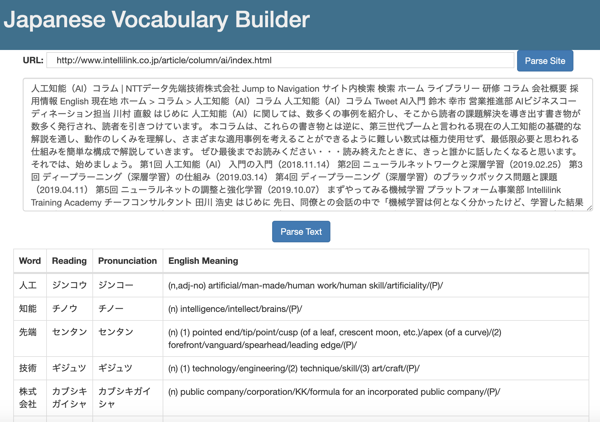

## Build API
```
cd api
mvn clean package
```

## Build Docker Images
```
docker-compose build
```

## Run Docker Images
```
docker-compose up
```

## Use the Service
Open `http://localhost:5001/` in browser, input `url` or `text` for parsing! 

